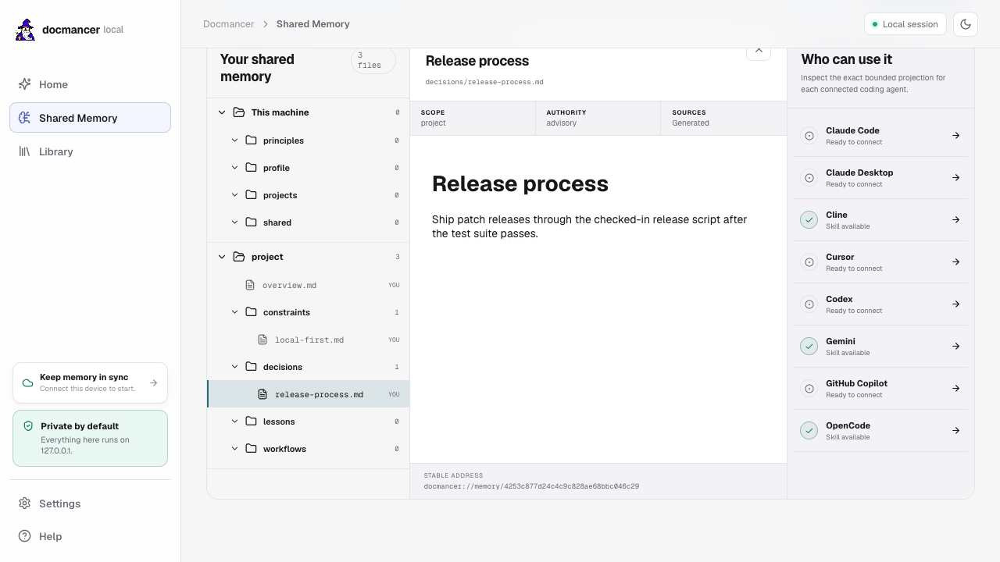

<div align="center">

# Docmancer

**Find out what your coding agents know, then carry the useful parts to every agent.**

[](https://pypi.org/project/docmancer/)
[](https://github.com/docmancer/docmancer/blob/main/LICENSE)
[](https://pypi.org/project/docmancer/)



</div>

Coding agents remember useful things, but each one keeps a different version. Claude Code may know why a deployment changed, Codex may know a project convention, and Cursor may still carry an old instruction. The evidence is spread across memory files, rules, instructions, and session history.

Docmancer helps answer two questions:

1. **What do my coding agents already know?**
2. **How do I carry the useful parts to every agent?**

It discovers existing agent memory, keeps its sources attached, and gives you one local place to ask questions, build readable Context, and connect that Context back to your agents.

The complete single-machine product is free and local. The browser app is for people. The CLI, skills, hooks, and MCP are how agents use the same memory.

## Start here

```bash
pipx install docmancer
docmancer setup
cd /path/to/your-project
docmancer web
```

`setup` finds every supported coding agent on the machine, shows one complete preflight plan and privacy warning, and asks for confirmation before changing anything. Once confirmed, it indexes existing memory and instructions, builds one laptop-wide canonical memory under `~/.docmancer/tree`, installs or updates every detected user-level Docmancer skill, and enables automatic recall and session capture wherever the agent supports them. It does not modify the project in your current directory.

The canonical memory keeps the main things that should follow you between agents: who you are, durable preferences, working principles, and active projects or repositories. Changed evidence is reconciled automatically when setup, Ask, the local web app, memory sync, or a supported lifecycle hook runs. If a configured AI provider is ready, Docmancer uses it to merge and compress the evidence after redaction. If no provider is ready, or the provider fails, deterministic local rules produce the same stable files without blocking memory.

`web` opens a loopback-only app for the current project. Its main pages each have one purpose:

- **Home** lets you ask Docmancer what your agents know, customise the Docmancer agent, and connect coding agents.
- **Context** turns scattered evidence into readable, revisioned knowledge that connected agents can carry.
- **Library** keeps curated memory, attributable agent evidence, and technical documentation easy to inspect without mixing them together.
- **Settings** chooses the provider and model used for grounded answers and AI-assisted Context distillation.

Claude Desktop requires a manual skill upload. Other supported integrations can be installed from the web app or CLI. Detection and installation are shown as separate states so an installed application is never mistaken for a connected agent.

## Ask what your agents know

```bash
docmancer ask "Why did we choose Railway?"
```

Docmancer checks for changed sources and returns a bounded answer with relevant project policy, curated memory, supporting agent evidence, and citations. It can recall evidence without a generation provider. Add `--answer` when you want a configured model to turn that evidence into grounded prose.

```bash
docmancer ask "What changed in our release process?" --answer
```

## Build Context every agent can carry

Context is the readable, revisioned result of consolidating the useful evidence Docmancer found. Preview the plan first:

```bash
docmancer context refresh --dry-run
```

Build AI-assisted Context from the CLI by naming the provider and model:

```bash
docmancer context refresh --provider openai --model <model-id>
```

Or build deterministic Context locally without an LLM:

```bash
docmancer context refresh --provider none
```

The web app shows the source count, cluster plan, provider, estimated calls, and cost before an AI build begins. Previous Context revisions remain available for comparison and rollback.

## Connect coding agents

`docmancer setup` installs all detected integrations and automatic recall and capture hooks during onboarding. Use `--yes` only when you have already reviewed the same plan and need a non-interactive run. You can manage one integration explicitly when needed:

```bash
docmancer agent install codex --hooks
docmancer agent install claude-code --hooks
```

Installed skills teach agents when to ask Docmancer for prior decisions and how to write deliberate project memory when you explicitly request it. Recall hooks provide a bounded view of the shared laptop memory and relevant project evidence automatically. Supported lifecycle hooks capture durable session conclusions and reconcile them without creating a per-item approval queue.

## Keep a decision deliberately

```bash
docmancer write $'# Deployment\n\nDeploy the API on Railway.' \
  --path decisions/deployment.md \
  --scope project
```

Read it later:

```bash
docmancer read decisions/deployment.md
```

Existing-file edits and moves require the current content hash returned by `read`. This prevents one agent from silently overwriting a newer decision.

## Import existing notes

```bash
docmancer import ./notes
```

Import copies Markdown into the project inbox. Docmancer never rewrites or moves the source files, and you review the complete file before turning it into curated memory.

## Everyday commands

| Command | Purpose |
| --- | --- |
| `docmancer setup` | Discover agent memory and connect supported coding agents. |
| `docmancer web` | Open the local human interface for the current project. |
| `docmancer ask "..."` | Recall curated memory and supporting agent evidence. |
| `docmancer context refresh --dry-run` | Preview a Context build without writing files or calling a provider. |
| `docmancer context refresh` | Build a deterministic local revision of shared Context. |
| `docmancer common` | Show knowledge recorded independently by several agents. |
| `docmancer delivery` | Show installed integrations, recall state, and recent use. |
| `docmancer timeline` | Show how curated memory changed. |
| `docmancer write ... --path file.md` | Write one deliberate Markdown memory file. |
| `docmancer read <address-or-path>` | Read one memory file and its provenance. |
| `docmancer edit ... --expected-hash <hash>` | Safely edit a memory file. |
| `docmancer move ... --expected-hash <hash>` | Safely rename or move a memory file. |
| `docmancer import ./notes` | Copy arbitrary Markdown into the project inbox. |
| `docmancer status` | Show local memory, source, security, integration, and Cloud health. |
| `docmancer doctor` | Diagnose installation and configuration problems. |
| `docmancer cloud sync` | Sync optional client-encrypted revisions. |

Run `docmancer --help` or `docmancer <command> --help` for exact arguments.

## Documentation is a separate Library

Your memory and third-party documentation answer different questions, so Docmancer keeps them separate:

```bash
docmancer docs add https://docs.pytest.org
docmancer docs query "How do I parametrize a fixture?"
```

Use `ask` for your decisions, preferences, rules, and agent evidence. Use `docs query` for libraries, APIs, and vendor documentation.

## Local privacy and optional Cloud

Your memory, Context, credentials, indexes, and local web app stay on your machine. Docmancer has no telemetry. Network access occurs only when you explicitly fetch online documentation, use an external model, check package registries, or enable Cloud.

Paid Personal Sync adds encrypted continuity across approved devices, managed history, and recovery. Team adds locally approved shared Context and encrypted coordination. The hosted service receives ciphertext and cannot read your plaintext memory or execute local actions.

```bash
docmancer cloud connect
docmancer cloud sync
```

## Local storage

| Location | Contents |
| --- | --- |
| `<project>/.docmancer/tree/` | Curated project memory as Markdown. |
| `<project>/.docmancer/context/` | Revisioned generated Context artifacts. |
| `<project>/.docmancer/inbox/` | Markdown explicitly imported for optional whole-file curation. Automatic session capture is processed as a transient spool. |
| `<project>/.docmancer/trash/` | Recoverable deleted memory files. |
| `<project>/.docmancer/state/decision-journal.jsonl` | Append-only curated-file history. |
| `<project>/.docmancer/state/delivery.json` | Recent successful Context delivery receipts. |
| `~/.docmancer/memory.db` | Rebuildable machine-wide agent-memory index. |
| `~/.docmancer/tree/` | Automatically reconciled laptop-wide canonical memory as source-attributed Markdown. |
| `~/.docmancer/state/laptop-memory/` | Reconciliation manifest and revision history. |
| `~/.docmancer/docmancer.yaml` | Local configuration. |

## Requirements

Docmancer supports Python 3.11, 3.12, and 3.13. If `pipx` selects Python 3.14, choose a supported interpreter:

```bash
pipx install docmancer --python python3.13
docmancer doctor
```

For detailed commands, architecture, supported sources, Cloud boundaries, and troubleshooting, see the [wiki](./wiki/Home.md).
